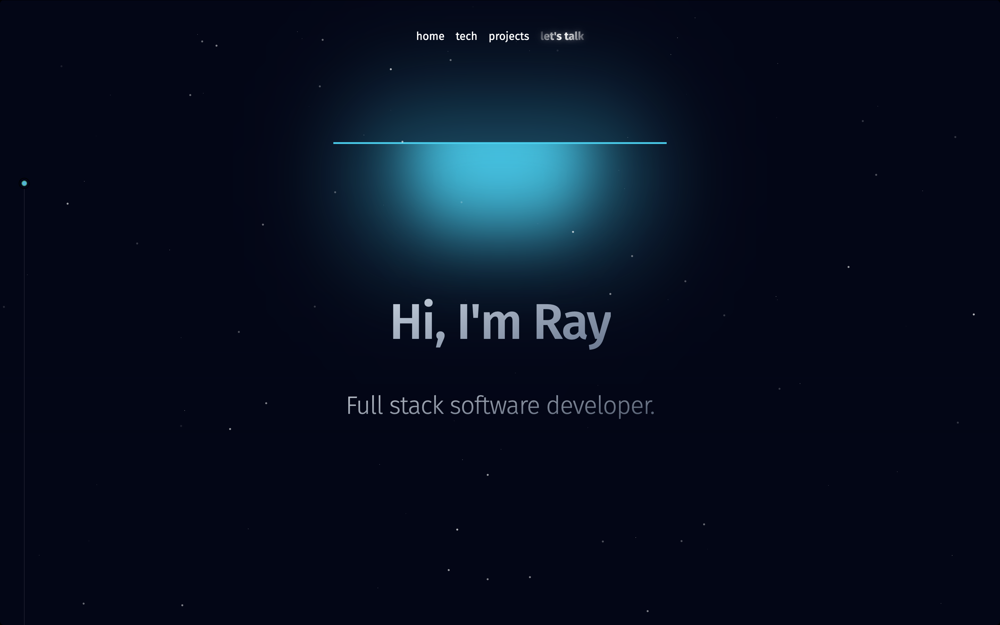
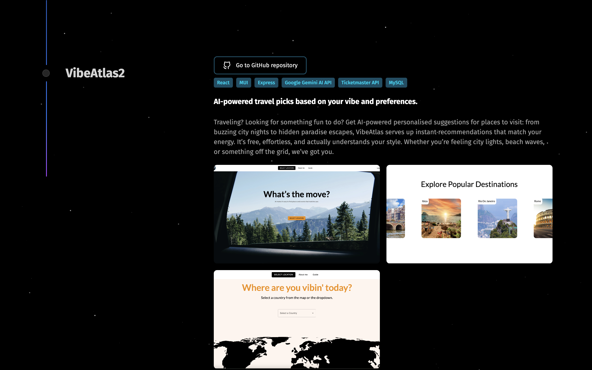

# Ray's Portfolio

[](screenshots/home.png)
[](screenshots/projects.png)

---

**Check out the live site here:** [https://raydandev.com/](https://raydandev.com/)

---

## Table of Contents

- [About The Project](#about-the-project)
- [Core Features](#core-features)
- [Built With / Tech Stack](#built-with--tech-stack)
- [APIs Used](#-apis-used)
- [Prerequisites / Dependencies](#prerequisites--dependencies)
- [How to Run](#how-to-run)
- [License](#license)
- [Contact](#contact)

---

## About The Project

A personal portfolio built with **React**, **Tailwind CSS**, and **Aceternity UI** that showcases projects dynamically using the **GitHub API**.  
The site displays project descriptions, technologies, and screenshots.

---

## Core Features

- **Technologies:** Overview of known programming languages and frameworks  
- **Projects:** Showcase of GitHub repositories with descriptions  
- **Contact:** Section to easily get in touch  

---

## Built With / Tech Stack

  [](https://react.dev/)
  
  [](https://tailwindcss.com/)
  
  [](https://ui.aceternity.com/)

---

## 🌐 APIs Used

[](https://docs.github.com/en/rest)

---

## Prerequisites / Dependencies

  [](https://nodejs.org/en)  
  (v18 or higher recommended)  
  
  [](https://www.npmjs.com/) 
  or 
  [](https://yarnpkg.com/)

---

## How to Run

```bash
1. Clone the repository
git clone https://github.com/iamrayghazali/portfolio.git
cd portfolio

2. Install dependencies
npm install

3. Start the development server
npm run dev
```

## License

License details coming soon.

## Contact
- Email: ghazali.raydan@gmail.com
- GitHub: github.com/iamrayghazali
